# Introduction

There is no concise or explicit research question being explored or
intended to be answered in this paper, it is more a discussion
considering one personal approach to improvisation. I will first discuss
the terms 'rhizome' and 'improvisation' as they are considered here and
where appropriate include the thinking that informed the uses of the
terms. I then discuss the philosophical positions informing the creation
of the Rhizomatic Improvisation System, then the system itself, and then
how it has been used and experienced in performance.

## The Rhizome 

Here the term rhizome references Deleuze and Guattari's discussions in
'A Thousand Plateaus; Capitalism and Schizophrenia' (2005, pp. 3--25).
This discussion does not provide a concise or pithy definition of the
term as used by Deleuze and Guattari, but instead offers many possible
ways to understand their use of the term, a few of which are listed
here. The rhizome is: a "*multiple that must be made*" (6), where any
point can and must be connected to anything other (7); something that
"ceaselessly establishes connections between semiotic chains,
organizations of power, and circumstances relative to the arts,
sciences, and social struggles." (7), it has no points or positions (8),
and is "anti-genealogy" (11). It is "not amenable to any structural or
generative mode", (12), but something that "intersect\[s\] roots and
sometimes merge\[s\] with them" (13), and so on. They also state that
"\[R\]ats are rhizomes" (6).

The Rhizomatic Improvisation System embraces these understandings. It
creates an outcome that must be made and is made in its multiple ways of
making, where all points are connected, and these connections become
semiotic chains that make organizations of power even though the points
and positions of each element made are individually powerless and are
ephemeral and momentary in time and space, the generation of structures
are created in the making, through the continuously merging and
intersecting of the ephemeral elements.

## Improvisation

Improvisation, in music it is often understood as 'making it up as you
go along' and is therefore made in its making. While this is primarily
true, there is much that underlies, informs, and constrains that
process. Steinweg (2012, p. 23) defines it as **"**a framed spontaneous
performance that is constituted by embodied discursive power
relationships." Sutton (2001, p. 1) hypothesizes that "free musical
improvisation is like conversation." Miles Davis is quoted as saying "If
you're not making a mistake, it's a mistake."; that and other quotes by
Davis can be found at (Western, 2023). David Toop (2008, p. 121) saw
differences in improvisation styles and approaches, saying "Dutch
improvisation was associated with humour, for example: German with high
energy free jazz; American with either the jazz tradition or the
influence of John Cage and indeterminacy; British with a more
intellectual, finely detailed approach."

The discussion above ranges across many possible topics within musical
improvisation, raising questions such as: is improvisation an embodiment
of discursive power relationships, is it a musical practice in which
mistakes are made; is it a conversation with non-lexical sounds; and/or
is it culturally based? This is just scratching the surface.

As well as these discussions there are also many systems of
improvisation, such as the Indian rag, George Russell (1974) and Barry
Harris' (Ciacca, n.d., pp. 6--23) systems of jazz improvisation, Derek
Bailey's curatorial approach (Childs et al., 1982, p. 20) and Ornette
Coleman's Harmolodics (1983). Each of these systems, which can be
considered training, and therefore possibly constraining, systems, has
their own strengths, both conceptually and in practice, but they also
localize and prescribe inherent possibilities of improvisation and
direct the improvisor.

My personal approach is that improvisation is very much like a
conversation. Within this conversation there are discursive power
relationships that are exercised, mistakes (or events are
interpreted/considered as mistakes by the creator and/or the
respondent/listener) are made (and possibly ameliorated), and this
occurs within specific cultures and tastes. All of these things may seem
invisible when in the act of improvising, however they are, to greater
or lesser extents, present, embraced, and exploited by the musicians.

The act of improvising, regardless of style, intention, or context,
requires attention to events that have happened, are happening, and may
happen in future. This capacity to predict the future is vital for the
improviser, and this ability, or the exercising of it, may be intuitive,
or at the other extreme, completely conscious and representative of or
constrained by training.

When improvising in traditional musical contexts such as jazz the sonic
context is mostly predictable, for example: shared expectations and
assumptions that there be: specific tunings, predictable periodic
divisions of time, and often known harmonic fields are used. Of course,
within these contexts a lot of freedoms are assumed and taken, but the
constraints significantly outweigh the freedoms.

In freer forms of musical improvisation, such as those of Fred Frith,
Cecil Taylor, Mary Halvorson, or Peter Brötzmann, a particular context,
or style, is expected of each of these improvisors, and therefore there
is some form of predictability for collaborators and audience. This
predictability exists within micro and macro contexts, such as
capacities of the performers and their instruments, within the
improvisation as it is happening, and the contexts of the
technical/physical/social environment. These contexts may provide
greater assumed freedoms within a set of possibly/potentially reduced
constraints. However, the constraints exist, even if they are simply the
limits of the improvisor's imagination and physical capacity, the
expectations of their audience, and/or the limits of their instrument.

The rhizomatic improvisation performed by Delusion Guitari plays with
the ideas of predictability within frameworks. While there are inherent
constraints, such as those provided by the instrument and capacity of
the performer and the duration of the performance other constraints,
such as a known or imposed framework, are absent. Instead, a set of
parameters relating to time and spatial placement are generated, the
improvisor sounds which will be played back into the environment at an
unknown time and location. Every sound is replayed indefinitely and the
improvisor must respond to and engage with the context(s) they have
created. Through this process a network of past, present, and potential
is made in its making. In this way a self-reflexive or rotating
conversation is generated for and by the improviser, one in which all
past actions and their potential future reactions are constantly
apparent, present, and active.

# Philosophy informing the Rhizomatic Improvisation System.

The rhizome can be considered a metaphor for a network of connections
that can be made between any points, regardless of their order or
position. By forming a non-hierarchical, non-linear, and open-ended
context it challenges the model of a temporally fixed and vertical
and/or horizontal structure with a single and clear direction.

Most musical improvisation has a fixed structure, and while this
structure may not be vertical it is certainly temporally lineal, and
with a clear direction. Musical improvisation based upon western tonal
systems, has an inherent sense of direction based on the guidelines of
functional harmony that is both obvious and well known to the improvisor
and listener (Drabkin, 2002; Rink, 1993; Schenker, 1954).

This was subverted to some extent by Schönberg's 12 tone system and the
subsequent theories and compositional approach that underly and then
stem from it, but the sensibility of direction is maintained.

Ornette Coleman defined his concept of Harmolodics as \"the use of the
physical and the mental of one\'s own logic made into an expression of
sound to bring about the musical sensation of unison executed by a
single person or with a group. \[Where\] harmony, melody, speed, rhythm,
time, and phrases all have equal position in the results that come from
the placing and spacing of ideas\". This may be seen as an extension of
Shönberg's 12 tone system, where initially each of the 12 notes of the
equal tempered musical system have equal value, therefore conceptually
subverting the inherent hierarchies and linear direction of Western
tonal music. For Coleman, every aspect of music, except for timbre, is
accounted for and given "equal position in the results that come from
the placing and spacing of ideas\". This equal position may be
considered as an equal value, and an expansion of Shönberg's approach,
but what (arguably) requires is an enhanced responsibility in the
improvisor/creator.

The approach used in rhizomatic improvisation is to consider the past,
present, and potential/future activity as contexts that that have an
equal structural value and influence. The improvisor must consider any
possible future results of any action, deliberate or not, with the
absolute understanding that that action will revisit at an unexpected
time. Therefore, it will recontextualize the structural value all
other past, current, and future actions.

This approach has a further overarching context, which focuses on
responsibility. It can be argued, for example, that a great many of the
current environmental problems needing to be addressed now are a result
of actions that were taken over the past 100 or so years. They are the
consequence of not considering, or deliberately ignoring or hiding, the
potential effect of those actions. Globally, this approach is now coming
back to bite. This is just one example of the consequences of not
considering all possible outcomes of actions.

The Rhizomatic Improvisation System creates a context for the
musician(s) where each of their actions will revisit them at an unknown
time and from an unknown location (when using multiple speaker systems),
this revisitation will continue unabated until the performance is
stopped. This causes the musician(s) to consider every action through
the lenses of: 'how will this action influence an action I might make in
the future (this future may become apparent at any time)', 'how can I
create a context that will enable other creative acts', 'how can I act
now in a way that will enhance future potentials or the future I am
creating', and 'how will I improvise within it and respond to the
contexts I have created'.

# The Rhizomatic Improvisation System

The rhizomatic improvisation system, shown in Figure 1 was developed in
Max and is essentially quite simple. It is a group of delays, Figure 2,
a spatialization arrangement, Figure 3, a sound movement system, Figure
4, a delay and spatializing randomizer, Figure 5,an effects and output
system, Figure 7, and a composition design interface, Figure 8. The
system shown in the images was used in the Divaldo Inspirace theatre
space and sound broadcast through a Timax soundhub (Out Board, 2023)
system that ensured phase coherence in the ambisonic sound dispersion.
There are 19 possible audio sources, eight delay sounds, 10 reverb (or
other effect) sounds, and one through signal from the instrument. In
this version a 16-speaker broadcast system was used, with speakers in
the places shown in Figure 3. These positions can be changed as needed,
as can the number of broadcast speakers and their configuration.

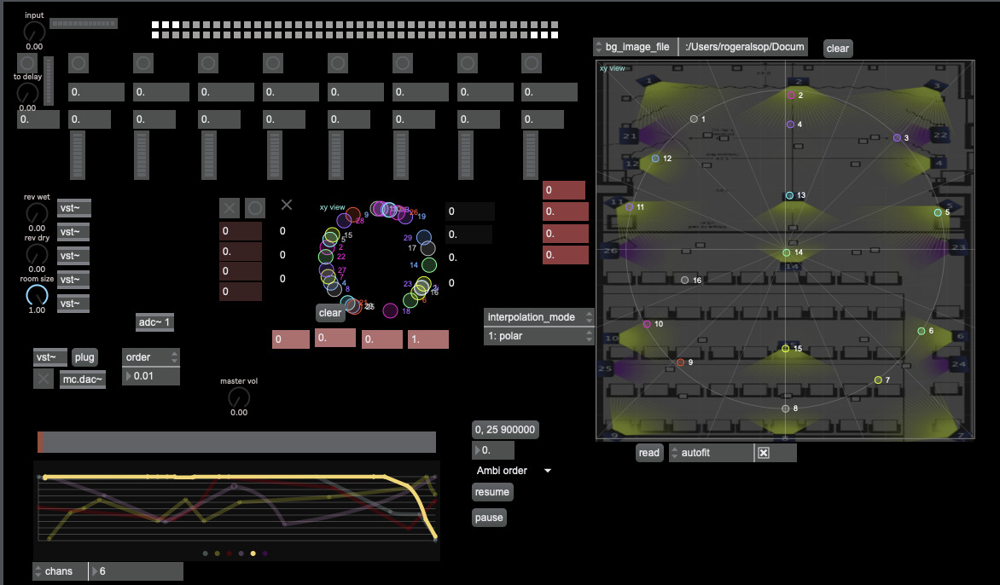

Figure 1 shows the entire interface of the Rhizomatic Improvisation
System as used in performance in the Divaldo Inspirace, Prague. It is
designed to allow quick access to important user controls, and to give
clear feedback of the changes in parameters and that occur during
performance.

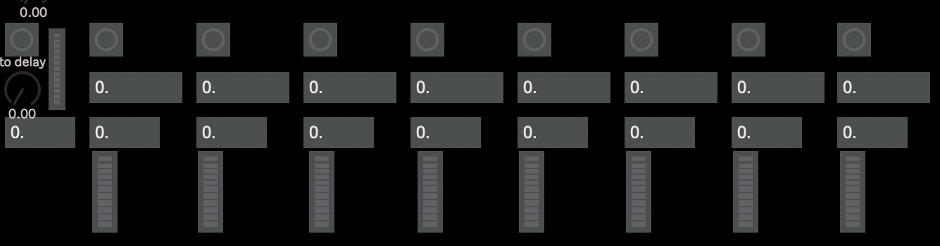{ width=80% }

Figure 2 shows the delay section prior to delay times being set. From
left to right we see a button to turn off all delays, underneath that is
a dial to control the signal to the delay systems, then a global
feedback setting (which is usually set to 1 to create infinite repeats),
and a meter to show signal level to the delay system. To the right of
these controls are eight repeating controls/indicators relating to each
delay line. These are, a button to turn off that specific delay, the
delay time, the feedback for that delay line. The delay time is usually
randomly set through the delay spatialization randomizer system, shown
in Figure 5.

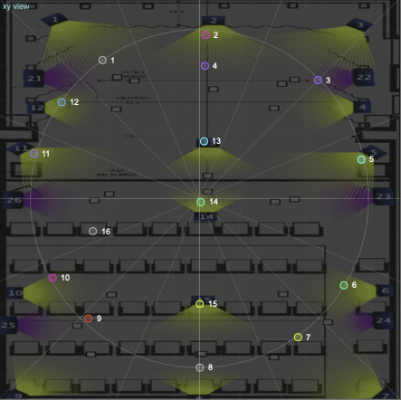{ width=50% }

Figure 3 shows the approximate placement of speakers in the Divaldo
Inspirace. The speaker positions can be moved according to the systems
that are being used. It is also possible to increase or decrease the
number of speakers for sound to be broadcast through end accordance with
the technology is available.

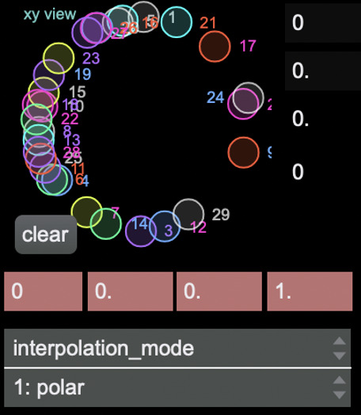{ width=25% }

Figure 4 is an example of the positioning of sounds within the speaker
system shown in Figure 3. In this case twenty-nine possible sound
sources were moved within the speaker positions shown in Figure 3. It is
not intended that the sound source is related directly to positions of
the speakers, for example sound source seventeen being broadcast
somewhere between speakers two and three. Instead, it was assumed that
this particular sound would move through the speaker system, but its
exact location may not relate directly to its position within the circle
shown in Figure 4. The intention here was to have the sound sources
continually moving, and for the musician to not be able to predict with
any accuracy where a sound source may come from; this would add to the
sense of, and requirement for, immediate re-activeness by the
improviser.

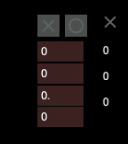{ width=25% }

The delay and spatialization randomizer section is the most important
part of the Rhizomatic Improvisation System. Here the delay times and
spatial movement of sounds data is generated. The numbers in red are,
from top to bottom: the number of random possibilities, the
multiplication of those possibilities, the number of presets, and the
time taken to generate those possibilities.

An example of how this works is: if 700 were chosen as the number of
random possibilities, and the multiplication number was set to 100,
delay times of between 100 and 70 thousand milliseconds would be
generated, trajectories of sounds would move from one position to
another (within a modulo of 360 degrees) and the movement from one
position to another may take anywhere between 100 and 70 thousand
milliseconds. The number of presets sets how many presets may be
generated, and the number of presets used may be selected by the
improviser. As there are only eight delays only eight of the 700
possible delay time presets are used as delay times. If the number of
presets is set to 18 only 18 of the possible 700 positions for sound
will be used, and only 18 of the possible transit times between one
sound position and another will be used.

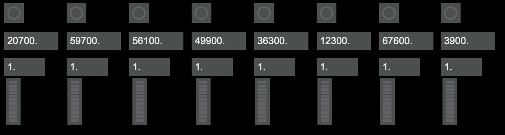{ width=80% }

An example of the possible delay times generated with this set of
numbers is shown in Figure 6. Here the delay times range from 3.9
seconds to 59.7 seconds, and with a feedback quotient of 1, which means
that the delays will continue until the system is turned off. It is
possible to lower the feedback level, resulting in fewer repeats; this
would be at the discretion of the improviser.

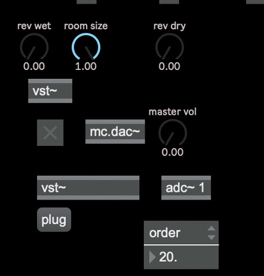{ width=30% }

Figure 7 shows the effects an output system. In this case the
TAL-Reverb-2 (TAL Software, 2023). It is possible for any software
effect to be used here. The rev wet, room size, and rev dry controls
relate specifically to that software. There are five effects units
engaged in this version of the Rhizomatic Improvisation System and in
this case each effect unit used the TAL-Reverb-2 software. It is also
possible have different effects used in each of the five VST slots
however this would require adjustment to the controls shown and what
they effect. Here the dry signal from the input and signals from the
delay units go into the effect units.

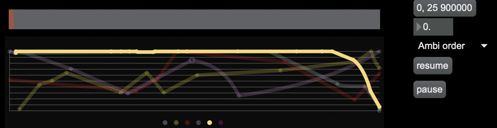{ width=80% }

Figure 8 provides an interface that can be used to affect some of the
variables in the automatic improvisation system. Here the variables are:
Ambi(sonic) order, rev wet (amplitude of the reverberation signal), rev
dry (amplitude of the dry signal coming from the reverberation units),
ambi motion speed (the speed at which the sounds move around within the
space), master amp (the overall level of the output to all of the
speakers), these are represented by the different coloured lines.

Ambi order sets the width of the sound in the speaker system, which
creates a focused location of the sound within the speaker system.
Figure 9, shows an order of 20 which would create a very
located image of the sound, and Figure 10, with an order of 0, would
create very diffused image of the sound.

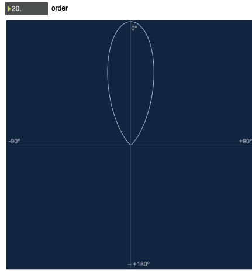{ width=40% }

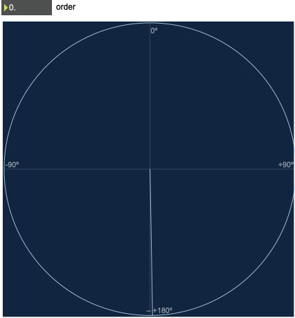{ width=40% }

In Figure 8 we see the Ambi order (the yellow line) at a high level that
then reduces towards the end of the time allocated for performance. In
this case the performance lasts for nine hundred seconds, or 15 minutes,
and the master amp is used to fade in and fade out at the beginning and
end of the performance.

# In performance

The Rhizomatic Improvisation System provides an experimentation process
that produces new forms of expression and experience. Improvisation,
whether collaborative or solo, "ceaselessly establishes connections
between semiotic chains, organizations of power (diatonic harmony), and
circumstances (contexts)..." and when at its freest is "not amenable to
any structural or generative mode". It is designed to provide processes
of becoming that are always in motion, always changing, and always
creating new options/possibilities.

While the inherent processes in the Rhizomatic Improvisation System are
quite simple: delays, effect, and spatialization, the impact on the
performance process is designed to create an essential sense in the
performer of simultaneously attending to the past, present, and
future(s) in each action.

When performing the performer is aware of the audience and, if present,
collaborators. this awareness may manifest as between wilful ignoring
to pandering. When improvising, and particularly when improvising
without a pre-ordained structure or context, there is a heightened
awareness of the actions of collaborators. This awareness then forms
sets of possibilities that the improviser may use, but this awareness is
based on the improvisor's short term/working memory (about 15 to 30
seconds (Atkinson & Wickens, 1971)) of recent actions/events and a
consequent sense of forthcoming potential events afforded by those
actions/events and how these may fit within the developing contexts
that are made.

A primary function in the performance and enjoyment of music is
predicting the future. In improvisation there is a "need for real-time
adaptation and mutual prediction based on information exchange between
interacting individuals," (Wiltshire & Fairhurst, 2022, p. 2). In
western composition there is the use of rhythmic, melodic, and harmonic
cadences. For example, the phrase

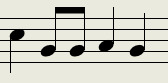{ width=25% }

creates a prediction of subsequent notes to be heard in both the
performer and the listener. If this prediction is not fulfilled a
variety of reactions may take place, ranging from frustration and
disappointment to joy. This reaction will depend on the context and the
character of the performer and/or the listener.

When performing with the rhizomatic improvisation system I was acutely
aware that every action I make, such as the choice and articulation of a
note, an unintended error, or even a change of volume or tone, will form
future contexts, and these actions may be from a past that resides
beyond my short-term memory. However, I could, for example, create
melodies, harmonies, and/or rhythms that could form a somewhat
predictable future, but this is impossible as I have no idea of *when*
the past melody, harmony, or rhythm would be articulate and what would
accompany from the other melodies, harmonies, and/or rhythms I had
played previously.

This causes a sense of trepidation that must be overcome, and in doing
so a faith that past actions will coalesce to form a coherent outcome
must be developed. Attention to the changing contexts and their rhythms
develops, forming a relationship between an unremembered past and
present actions, and at the same time a sense of future contexts become
apparent. The process is that each the contexts that are created become
known as they develop, and I gain are stronger understanding of the
context(s) that I have created. Often this requires simply listening to
what has been created without necessarily contributing to it, and this
way I become the simultaneous creator and audience.

In performance an inner sense of 'flow' that reflects the two conditions
of flow[^1] and engages the six characteristics of being in a subjective
state of flow[^2] (Nakamura & Csikszentmihalyi, 2002, p. 90), with
oscillation between the three parts of the original model of the flow
state, anxiety, flow, and boredom (2002, p. 94) is created. As the
performance develops it becomes easier enter this state, as the constant
state of flux between each of the sounds, along with their continually
rotating interactions, form a hypnotic experience when performing is
enhanced by the sense of each action adding to and interacting within
that rotating flux.

# Conclusion

The rhizomatic improvisation system is one that creates a holistic work
through the simultaneous exposition of the improvisors' past and present
acts. This causes an outcome in which all the acts made are
simultaneously represented. The gaps between acts become sonic spaces
that can be filled with previous or future acts, and the temporal
placement of each act is decided by the performer and by the system.

While no overt research question was presented in this paper, as a
performer and improviser the question that I was asking myself was 'how
I can represent my past and present acts in such a way that they inform
all future acts that I find satisfactory. The rhizomatic improvisation
system is an approach which enables and begins to explore that question.

# References

```{=latex}
\begin{hangparas}{1.5em}{1}
```

Atkinson, R. C., & Wickens, T. D. (1971). Human memory and the concept
of reinforcement. *The Nature of Reinforcement*, 66--120. Retrieved from
Google Scholar

Childs, B., Hobbs, C., Austin, L., Prevost, E., Rowe, K., Bailey, D.,
... Schwartz, E. (1982). Improvisation. *Perspectives of New Music*,
26--111. Retrieved from Google Scholar

Ciacca, A. (n.d.). Barry Harris: The Art of Teaching Jazz. Retrieved
from Google Scholar

Coleman, O. (1983). Prime time for harmolodics. *Down Beat*, *7*,
54--55.

Deleuze, G., & Guattari, F. (2005). *A Thousand Plateaus: Capitalism and
Schizophrenia*. Retrieved from Google Scholar

Drabkin, W. (2002). Heinrich Schenker. Retrieved from Google Scholar

Jones, O., & Russell, G. (1974). A New Theory for Jazz. *The Black
Perspective in Music*, 63--74. Retrieved from Google Scholar

Nakamura, J., & Csikszentmihalyi, M. (2002). The concept of flow. In C.
R. Snyder & S. J. Lopez (Eds.), *Handbook of positive psychology* (pp.
89--105). Oxford University Press. Retrieved from Google Scholar

Out Board. (2023). *TiMax soundhub*. Retrieved from
https://www.timaxspatial.com/

Rink, J. (1993). Schenker and improvisation. *Journal of Music Theory*,
*37*(1), 1--54. Retrieved from Google Scholar

Schenker, H. (1954). *Harmony* (Vol. 1). University of Chicago Press.
Retrieved from Google Scholar

Steinweg, D. A. (2012). *Improvisational music performance: On-stage
communication of power relationships*. University of South Florida.
Retrieved from Google Scholar

Sutton, J. P. (2001). *'The Invisible Handshake': An Investigation of
Free Musical Improvisation as a Form of Conversation*. Citeseer.
Retrieved from Google Scholar

TAL Software. (2023). *TAL-Reverb-2*. TAL Software. Retrieved from
https://tal-software.com/products/tal-reverb

Toop, D. (2008). SEARCH AND REFLECT: THE CHANGING PRACTICE OF
IMPROVISATION. *New Sound: International Magazine for Music*, (32).
Retrieved from Google Scholar

Western, D. (2023, April 10). 42 Ingeniously Motivational Miles Davis
Quotes. Retrieved 9 July 2023, from
https://wealthygorilla.com/16-motivational-miles-davis-quotes/

Wiltshire, T. J., & Fairhurst, M. T. (2022). Collaborative creativity:
Information-driven coordination dynamics and prediction in movement and
musical improvisation. In *The Routledge International Handbook of
Creative Cognition* (pp. 624--645). Routledge. Retrieved from Google
Scholar

```{=latex}
\end{hangparas}
```

[^1]: Perceived challenges, or opportunities for action, that stretch
    (neither overmatching nor underutilizing) existing skills; a sense
    that one is engaging challenges at a level appropriate to one's
    capacities, and clear proximal goals and immediate feedback about
    the progress that is being made.

[^2]: Intense and focused concentration on what one is doing in the
    present moment

    Merging of action and awareness

    Loss of reflective self-consciousness (i.e., loss of awareness of
    oneself as a social actor)

    A sense that one can control one's actions; that is, a sense that
    one can in principle deal with the situation because one knows how
    to respond to whatever happens next

    Distortion of temporal experience (typically, a sense that time has
    passed faster than normal)

    Experience of the activity as intrinsically rewarding, such that
    often the end goal is just an excuse for the process.
